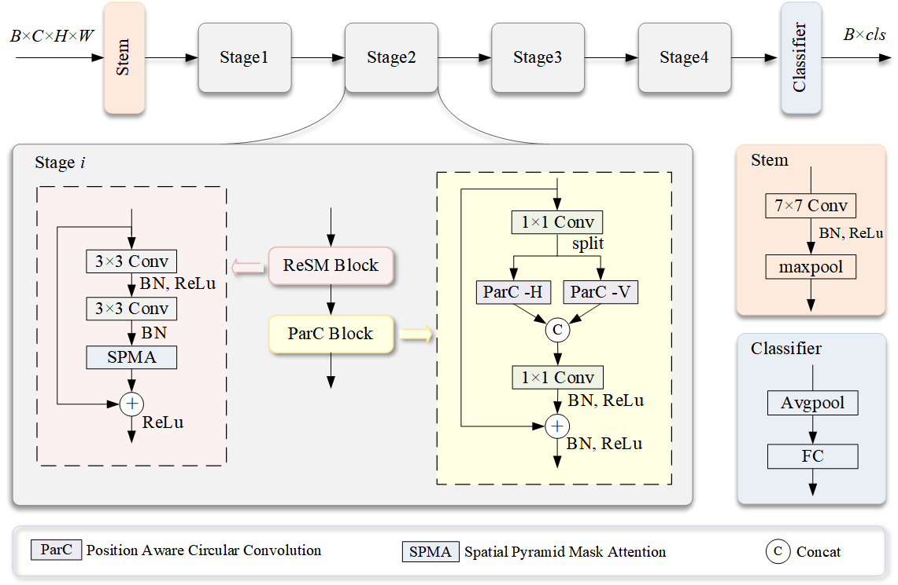

# ParC-ReSMNet
Here is the paper we publish "A novel convolutional neural network with global perception for bearing fault diagnosis".
Please refer to the paper for more information. This repo is based on PyTorch.

## Introduction
Aiming at the limitations of convolutional neural networks in global feature extraction and the low accuracy caused by this deficiency in bearing fault diagnosis based on acoustic signals, this paper proposes a novel ConvNet with global perception capabilities called ParC-ReSMNet.

## Network Architecture

